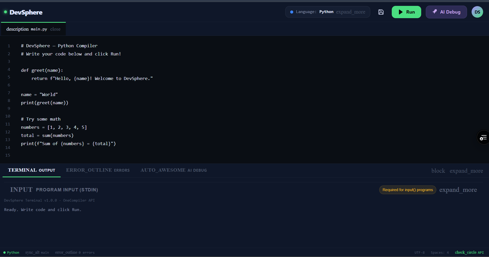

<h1 align="center">DevSphere — AI-Powered Online Code IDE</h1>

<p align="center">
  <strong>Write, run, debug, and save code with AI-powered assistance.</strong>
</p>

<p align="center">
  Next.js • React • TypeScript • Tailwind CSS • Google Gemini • Judge0
</p>

<p align="center">
  <a href="https://dev-sphere-psi.vercel.app/">
    <strong>🌐 Live Application</strong>
  </a>
</p>

---

## 🖥️ Dashboard Preview

<p align="center">
  
</p>

---

## 📌 Overview

**DevSphere** is a modern, browser-based online code IDE designed to make coding, execution, debugging, and project management simple and accessible.

It allows users to write and execute programs directly from the browser while providing **AI-powered debugging assistance** through Google Gemini.

DevSphere currently supports:

* 🐍 Python
* ☕ Java
* ⚙️ C

Code execution is handled through the **Judge0 API**, while Google Gemini analyzes compilation and runtime errors and provides understandable explanations and suggestions.

---

## ✨ Features

| Feature                       | Description                                             |
| ----------------------------- | ------------------------------------------------------- |
| 💻 **Multi-Language Support** | Write and execute Python, Java, and C programs          |
| 📝 **Code Editor**            | Modern editor with syntax highlighting and line numbers |
| ▶️ **Code Execution**         | Execute code and view output directly in the browser    |
| 🤖 **AI Debugging**           | Analyze errors and receive AI-generated explanations    |
| 💾 **Save Projects**          | Save and manage code projects using browser storage     |
| 📊 **User Dashboard**         | Centralized access to compiler and saved projects       |
| 📱 **Responsive UI**          | Optimized for desktop and different screen sizes        |

---

## 🛠️ Tech Stack

| Technology           | Purpose                                 |
| -------------------- | --------------------------------------- |
| **Next.js**          | Full-stack React framework              |
| **React**            | User interface development              |
| **TypeScript**       | Type-safe application development       |
| **Tailwind CSS**     | Styling and responsive UI               |
| **Radix UI**         | Accessible UI components                |
| **Google Gemini**    | AI-powered debugging and error analysis |
| **Judge0 API**       | Remote code compilation and execution   |
| **Node.js**          | Backend runtime                         |
| **Vercel / Netlify** | Application deployment                  |

---

## 🏗️ Application Architecture

```text
                    ┌───────────────────┐
                    │       User        │
                    └─────────┬─────────┘
                              │
                              ▼
                    ┌───────────────────┐
                    │    DevSphere IDE  │
                    └─────────┬─────────┘
                              │
                    ┌─────────▼─────────┐
                    │  Select Language  │
                    └─────────┬─────────┘
                              │
                    ┌─────────▼─────────┐
                    │    Write Code     │
                    └─────────┬─────────┘
                              │
                    ┌─────────▼─────────┐
                    │    Run Program    │
                    └─────────┬─────────┘
                              │
                              ▼
                    ┌───────────────────┐
                    │     Judge0 API    │
                    └─────────┬─────────┘
                              │
                              ▼
                    ┌───────────────────┐
                    │ Terminal / Output │
                    └───────────────────┘

                 If an error occurs
                              │
                              ▼
                    ┌───────────────────┐
                    │    Ask AI / Debug │
                    └─────────┬─────────┘
                              │
                              ▼
                    ┌───────────────────┐
                    │   Google Gemini   │
                    └─────────┬─────────┘
                              │
                              ▼
                    ┌───────────────────┐
                    │ Error Explanation │
                    │   & Suggestions   │
                    └───────────────────┘
```

---

## 🔄 How DevSphere Works

### 1. Write Code

Users open the DevSphere compiler and select a supported programming language.

### 2. Execute Code

The written code is sent to the compiler API and executed through **Judge0**.

### 3. View Results

The compiler returns the program's output, compilation result, or runtime error to the terminal.

### 4. AI Debugging

If an error occurs, users can request AI assistance.

The error information is analyzed using **Google Gemini**, which provides:

* Error explanation
* Possible cause
* Suggested solution
* Coding recommendations

### 5. Save Projects

Users can save their code projects locally and access them later from the **Saved Projects** section.

---

## 🔌 API Routes

| Method | Endpoint              | Purpose                                 |
| ------ | --------------------- | --------------------------------------- |
| `POST` | `/api/compiler/run`   | Compile and execute source code         |
| `POST` | `/api/compiler/debug` | Analyze code errors using Google Gemini |

---

## 💾 Data Storage

DevSphere currently uses **browser `localStorage`** for lightweight client-side storage.

It is currently used for:

* Login session information
* Saved code projects
* User-specific local data

> **Note:** DevSphere does not currently require an external database for its core functionality.

A database-backed storage system is planned for future versions.

---

## 📁 Project Structure

```text
Devsphere/
│
├── app/
│   ├── api/
│   │   └── compiler/
│   │       ├── run/
│   │       └── debug/
│   │
│   ├── compiler/
│   ├── home/
│   ├── login/
│   ├── register/
│   └── saved-projects/
│
├── components/
│   ├── compiler/
│   ├── home/
│   └── ui/
│
├── hooks/
├── lib/
├── types/
├── utils/
├── constants/
├── docs/
│
├── .env.example
├── package.json
└── README.md
```

---

## 🚀 Getting Started

Follow the steps below to run DevSphere locally.

### Prerequisites

Make sure you have the following installed:

* **Node.js 18+**
* **npm**
* **Git**

### 1. Clone the Repository

```bash
git clone YOUR_GITHUB_REPOSITORY_URL
cd Devsphere
```

### 2. Install Dependencies

```bash
npm install
```

### 3. Configure Environment Variables

Create a `.env.local` file in the root directory:

```env
GEMINI_API_KEY=your_gemini_api_key
<<<<<<< HEAD
GEMINI_MODEL=gemini-2.5-flash-lite
=======

# Optional: Specify which Gemini model to use
GEMINI_MODEL=gemini-3.5-flash-lite

# RapidAPI (Judge0 Code Execution)
>>>>>>> origin/main
RAPIDAPI_KEY=your_rapidapi_key
NODE_ENV=development
```

Replace the placeholder values with your actual API credentials.

> ⚠️ **Security:** Never commit `.env.local` or expose API keys in your GitHub repository.

### 4. Run the Development Server

```bash
npm run dev
```

Open the application at:

```text
http://localhost:3000
```

---

## 📦 Production Build

Create a production build using:

```bash
npm run build
```

Then start the production server:

```bash
npm start
```

---

## 🌐 Live Application

<p align="center">
  <a href="https://dev-sphere-psi.vercel.app/">
    <strong>🚀 Open DevSphere</strong>
  </a>
</p>

---

## 🔮 Future Enhancements

The following features are planned for future versions:

<<<<<<< HEAD
* 🗄️ Database-backed project storage
* 🔐 OAuth / JWT authentication
* 👥 Real-time code sharing and collaboration
* 🌍 Support for additional programming languages
* 🧠 Advanced AI debugging and code explanation
* 🔀 Git and GitHub integration
* 📂 Cloud-based project management
* ⚡ Improved code execution experience
* 📊 Coding activity and project analytics
=======
- **Limits:**
  - 5 second CPU time per execution
  - 128MB memory per execution

### 2. **Google Generative AI (Gemini)**
- **Endpoint:** `https://generativelanguage.googleapis.com`
- **Models:**
  - Primary: gemini-3.5-flash-lite
  - Fallback: gemini-2.5-flash, gemini-3.1-flash-lite

- **Usage Process:**
  1. Build prompt with code and error
  2. Call Gemini API
  3. Parse response and return to frontend
  
- **Capabilities:**
  - Error explanation
  - Code review
  - Educational feedback
>>>>>>> origin/main

---

## 🎯 Project Goals

DevSphere was built with the goal of combining a **browser-based development environment** with **AI-assisted debugging**.

The project focuses on making programming more accessible by allowing users to:

> **Write → Run → Understand → Fix → Save**

all within a single platform.

---

## 👨‍💻 Author

<p align="center">
  <strong>Mohamed Saif</strong><br>
  Frontend Developer | AI & Web Development
</p>

<p align="center">
  <a href="https://github.com/mohamedsaif21">GitHub</a>
  &nbsp;•&nbsp;
  <a href="https://www.linkedin.com/in/mohamed-saif24/">LinkedIn</a>
  &nbsp;•&nbsp;
  <a href="mailto:mohamedsaifb24@gmail.com">Email</a>
</p>

---

<p align="center">
  ⭐ If you found DevSphere useful, consider giving the repository a star!
</p>
